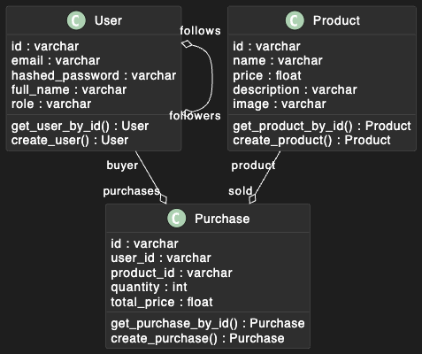
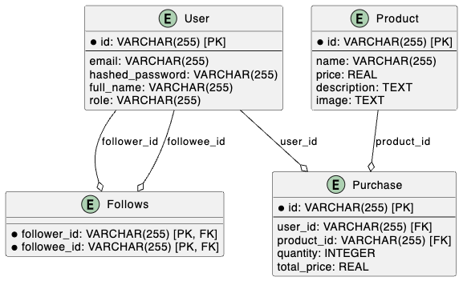
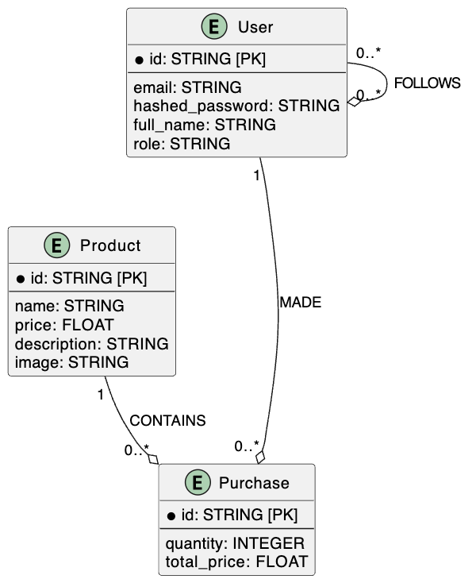

1. Modèles de Données  

Nous allons définir trois collections :  
	•	users : Gère les utilisateurs et leurs relations de followers.  
	•	products : Gère les produits disponibles.  
	•	purchases : Gère les achats effectués par les utilisateurs.  

	

		<h3>SQL diagram:</h3>
		
	

	

		<h3>NOSQL diagram:</h3>
		
	

2. Init databases:
**Make sure to have docker, docker-compose, python and pypi installed**
